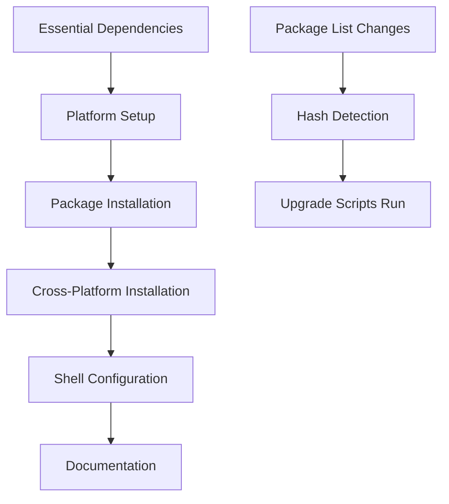

# `.chezmoiscripts` - Automated Package Management System

This directory contains the modular, hash-based package management system that automatically installs and maintains packages across macOS, Linux, and cross-platform environments. The system uses a **run_once/run_onchange pattern** for optimal performance and resource efficiency.

## 📁 Directory Structure

```
.chezmoiscripts/
├── README.md                              # This documentation
├── common/                                # Cross-platform package managers
│   ├── run_once_after_70-install-cargo-packages.sh.tmpl
│   ├── run_onchange_after_71-upgrade-cargo-packages.sh.tmpl
│   ├── run_once_after_71-install-npm-packages.sh.tmpl
│   ├── run_onchange_after_72-upgrade-npm-packages.sh.tmpl
│   ├── run_once_after_72-install-go-packages.sh.tmpl
│   ├── run_once_after_73-install-python-packages.sh.tmpl
│   └── run_onchange_after_73-upgrade-python-packages.sh.tmpl
├── darwin/                                # macOS-specific package managers
│   ├── run_once_before_10-homebrew-setup.sh.tmpl
│   ├── run_once_after_20-install-homebrew-taps.sh.tmpl
│   ├── run_onchange_after_21-upgrade-homebrew-packages.sh.tmpl
│   ├── run_once_after_30-install-homebrew-formulas.sh.tmpl
│   ├── run_once_after_40-install-homebrew-casks.sh.tmpl
│   ├── run_once_after_50-install-mas-apps.sh.tmpl
│   └── run_once_after_60-install-vscode-extensions.sh.tmpl
├── linux/                                # Linux-specific package managers
│   ├── run_once_after_20-install-flatpak-apps.sh.tmpl
│   ├── run_onchange_after_21-upgrade-linux-packages.sh.tmpl
│   ├── run_once_after_30-install-apt-packages.sh.tmpl
│   └── run_once_after_40-install-snap-packages.sh.tmpl
├── run_once_before_00-install-essentials.sh.tmpl      # Essential dependencies first
├── run_after_configure-shell.sh.tmpl                  # Shell configuration
└── run_onchange_after_99-package-management-system.sh.tmpl # System documentation
```

## 🎯 Architecture Overview

### **Two-Phase Pattern**
1. **Installation Phase (`run_once_*`)**: Install packages **once** on first `chezmoi apply`
2. **Upgrade Phase (`run_onchange_*`)**: Upgrade packages **only** when package lists change

### **Benefits**
- ✅ **Performance**: No reinstalls on every `chezmoi apply`
- ✅ **Efficiency**: Hash-based detection triggers upgrades only when needed
- ✅ **Resource-friendly**: Reduces bandwidth and system load
- ✅ **Predictable**: Clear separation between install and upgrade logic

## 📋 Script Categories

### **Essential Setup (`run_once_before_00-*`)**
**Purpose:** Install foundational dependencies required by other scripts

**Features:**
- Installs Homebrew on both macOS and Linux
- Sets up essential CLI tools (git, zsh, etc.)
- Configures Flatpak on Linux systems
- Runs **before** all other package installation scripts

### **Platform Setup (`run_once_before_10-*`)**
**macOS Only:** Complete Homebrew installation and configuration
- Detects ARM64 vs Intel architecture
- Configures proper Homebrew paths
- Sets up shell environment integration

### **macOS Package Management (`darwin/`)**

#### Installation Scripts (`run_once_after_*`)
- **`20-install-homebrew-taps`**: Add Homebrew taps (third-party repositories)
- **`30-install-homebrew-formulas`**: Install CLI tools and libraries
- **`40-install-homebrew-casks`**: Install GUI applications
- **`50-install-mas-apps`**: Install Mac App Store applications
- **`60-install-vscode-extensions`**: Install VS Code extensions

#### Upgrade Scripts (`run_onchange_after_*`)
- **`21-upgrade-homebrew-packages`**: Single unified upgrade for all Homebrew packages

### **Linux Package Management (`linux/`)**

#### Installation Scripts (`run_once_after_*`)
- **`20-install-flatpak-apps`**: Install Flatpak applications (GUI app equivalents)
- **`30-install-apt-packages`**: Install APT packages (CLI tool equivalents)
- **`40-install-snap-packages`**: Install Snap packages (fallback for missing tools)

#### Upgrade Scripts (`run_onchange_after_*`)
- **`21-upgrade-linux-packages`**: Unified upgrade for APT, Flatpak, and Snap

### **Cross-Platform Package Management (`common/`)**

#### Installation Scripts (`run_once_after_*`)
- **`70-install-cargo-packages`**: Install Rust/Cargo tools
- **`71-install-npm-packages`**: Install NPM global packages  
- **`72-install-go-packages`**: Install Go binaries
- **`73-install-python-packages`**: Install Python packages

#### Upgrade Scripts (`run_onchange_after_*`)
- **`71-upgrade-cargo-packages`**: Update Rust toolchain and packages
- **`72-upgrade-npm-packages`**: Update NPM global packages
- **`73-upgrade-python-packages`**: Update Python user packages

### **Post-Installation (`run_after_*`)**
- **`configure-shell`**: Configure shell environment after all packages are installed
- **`99-package-management-system`**: Display system documentation and package counts

## 🔄 Execution Flow



### **Execution Order**
1. **`run_once_before_00-*`** - Essential tools first
2. **`run_once_before_10-*`** - Platform setup (macOS)  
3. **`run_once_after_20-60-*`** - Initial platform package installation
4. **`run_once_after_70-73-*`** - Initial cross-platform installation
5. **`run_onchange_after_21-*`** - Platform upgrades (when package lists change)
6. **`run_onchange_after_71-73-*`** - Cross-platform upgrades (when package lists change)
7. **`run_after_*`** - Shell configuration and documentation

## 🔧 Package Sources

### **Package Lists**
All package lists are defined in `home/.chezmoidata/packages.toml`:

```toml
[packages.darwin]
taps = ["homebrew/bundle", ...]
brews = ["git", "zsh", ...]
casks = ["visual-studio-code", ...]

[packages.linux]
flatpak = ["com.visualstudio.code", ...]
apt = ["git", "zsh", ...]
snap = ["gh", ...]

[packages.cargo]
crates = ["cargo-update"]
```

### **Hash-Based Detection**
Each script embeds a hash of its relevant package list:

```bash
# Hash based on: {{ .packages.darwin.brews | join "," }}
```

When package lists change in `packages.toml`, the hash changes, triggering the script to run.

## 🛠️ Script Features

### **Shared Logging System**
All scripts use a common logging template (`../.chezmoitemplates/logging.sh`):

```bash
{{ template "logging.sh" . }}

log_header "🍺 HOMEBREW PACKAGES"
log_info "Installing packages..."
log_success "✅ Installation completed!"
```

### **Error Handling**
- **Graceful degradation**: Missing package managers are handled gracefully
- **Dependency checks**: Scripts verify required tools before proceeding  
- **User guidance**: Clear error messages with installation instructions
- **Partial failures**: Continue processing even if some packages fail

### **Platform Detection**
Scripts automatically adapt to the target platform:

```bash
{{- if eq .chezmoi.os "darwin" }}
# macOS-specific logic
{{- else if eq .chezmoi.os "linux" }}
# Linux-specific logic
{{- end }}
```

## 📊 Management Tools

### **View Package Counts**
```bash
chezmoi apply  # Runs documentation script showing package counts
```

### **Force Upgrades**
```bash
# Edit a package list in packages.toml to trigger upgrades
# Or remove chezmoi state to force reinstalls
chezmoi state delete-bucket --bucket=scriptState
```

### **Debug Script Execution**
```bash
chezmoi apply --verbose  # Show which scripts are running
chezmoi execute-template < .chezmoiscripts/darwin/script.tmpl  # Test template
```

## 🔗 Related Files

- **Package definitions**: `home/.chezmoidata/packages.toml`
- **Static configuration**: `home/.chezmoidata/`
- **Logging template**: `home/.chezmoitemplates/logging.sh`
- **Generated scripts**: `$HOME/.local/share/chezmoi/`

## 📝 Adding New Packages

1. **Edit package lists** in `home/.chezmoidata/packages.toml`
2. **Run chezmoi apply** - hash change triggers relevant upgrade scripts
3. **New package managers** require new scripts following naming conventions

## 🎯 Best Practices

- **Installation scripts** should be idempotent (safe to run multiple times)
- **Upgrade scripts** should handle missing packages gracefully
- **Use shared logging** for consistent output formatting
- **Test on both platforms** when modifying cross-platform scripts
- **Follow naming conventions** for proper execution order
